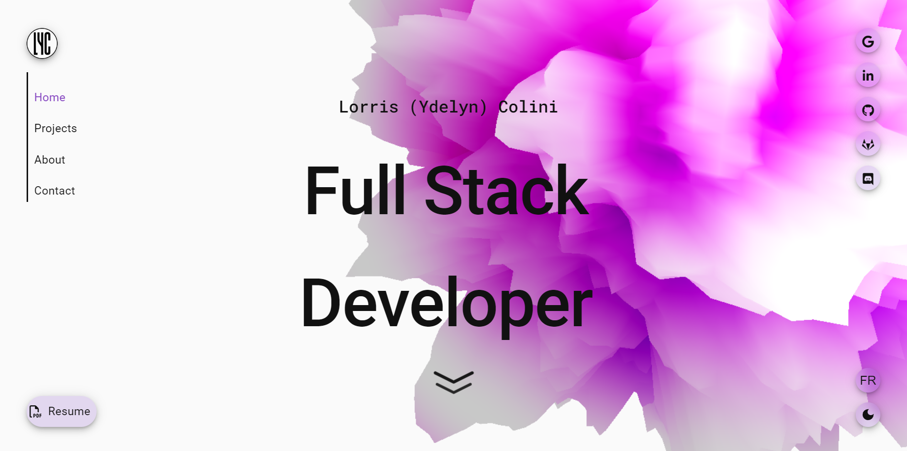

# Portfolio 2024

Bienvenue dans mon portfolio de 2024 ! Ce référentiel contient une collection de mes projets, compétences et réalisations récentes.

## Aperçu

Ce portfolio est une vitrine de mes compétences en développement, design et autres domaines connexes. Il comprend une variété de projets, allant de petits exercices de codage à des applications plus importantes.

## Contenu

- **Projets:** Une liste de mes projets récents avec des descriptions détaillées et des liens vers les projets correspondants.
  
- **Présentation:** Une rapide présentation de moi-même et mes appétences.

- **Contact:** Un formulaire de contact disponible, ainsi que mon CV.

## Comment contribuer

Si vous avez des suggestions pour l'amélioration de mes projets existants, des idées pour de nouveaux projets ou des commentaires généraux, n'hésitez pas à ouvrir une issue ou à soumettre une demande de pull request. Votre contribution est appréciée !

## Contact

Vous pouvez me contacter directement sur mon site :

  **Site Web:** [www.lycdev.tech](https://www.lycdev.tech)

N'hésitez pas à me contacter pour toute question, opportunité ou collaboration potentielle.

Merci d'avoir visité mon portfolio !
